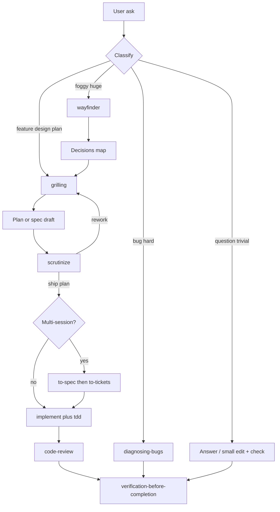

# Design: default thinking = Matt flow + gates (not a second brain)

## Verdict

**Yes — put a thinking process in the harness by default**, but as a **thin router into Matt Pocock skills**, not a second philosophy pasted from leaked prompts or a Fable system dump.

| Layer | Put what |
|-------|----------|
| Always-on (`AGENTS.md`) | ~15–25 lines: classify → which Matt path → mandatory gates (`scrutinize` on plans, verify before done) |
| Skills (on demand) | Full Matt procedures (`grilling`, `wayfinder`, `implement`, …) + `scrutinize` |
| Tool adapters | Effort / model tier / hooks (Hermes, Claude) — not universal prose |

**Do not** paste contents from [system_prompts_leaks](https://github.com/asgeirtj/system_prompts_leaks) into `AGENTS.md`. Extract *principles* only (verify, progressive disclosure, adversarial review). Leaked blobs bloat every turn and fight the thin-harness work we just shipped.

---

## Why Matt already *is* the thinking process

From `ask-matt` (already installed):

```text
idea → grilling (+ domain-modeling in repo)
     → [foggy/huge?] wayfinder → to-spec
     → to-spec → to-tickets  OR  implement
     → implement (drives tdd) → code-review
bugs → diagnosing-bugs | triage
sessions → handoff across smart-zone
```

You do **not** need a parallel “Fable Method skill suite.” You need **default wiring** so agents invoke this instead of freestyling.

Anthropic aligns: [CLAUDE.md / AGENTS = short always-on](https://claude.com/blog/steering-claude-code-skills-hooks-rules-subagents-and-more); procedures live in **skills** (progressive disclosure). [Explore → plan → code](https://code.claude.com/docs/en/best-practices) + verify + adversarial review = same shape as grilling → plan → scrutinize → implement → verification-before-completion.

---

## Recommended default graph



### Composite defaults (what you asked for)

| Situation | Default chain |
|-----------|----------------|
| Design / plan / “แพลนให้หน่อย” | `grilling` → draft → **`scrutinize`** → only then present as final |
| Foggy / greenfield / multi-week | **`wayfinder`** first → then merge to grilling / to-spec |
| Normal feature in known repo | `grilling` (+ `domain-modeling`) → implement path |
| Before any “done / shipping” claim | `verification-before-completion` (already in AGENTS) |
| Unsure | `ask-matt` |

`scrutinize` after every plan is **yes** — cheap gate, high signal (Anthropic “adversarial review” pattern).  
`grilling` + `wayfinder` together is **not** default both at once: wayfinder when the map is missing; grilling when the idea fits one session (Matt’s own distinction).

---

## Fable: use principles, not the model card as policy

Useful Fable-aligned harness rules (already partly in AGENTS):

1. **Match depth to task** — trivial short path; hard → plan / heavier model in *adapter*.
2. **Orchestrator ≠ worker** — Hermes / main agent routes; desk agent implements (you already do this).
3. **Don’t dump hidden CoT into the user reply** — report outcomes; keep reasoning internal.
4. **Progressive disclosure** — skills on demand; keep AGENTS thin.
5. **Handoff before smart-zone death** — Matt `handoff` = context survival.

Skip: copying Fable system prompts, mandating `output_config.effort` in universal AGENTS (not all tools support it).

---

## What to change in harness (implementation sketch)

### A. Always-on — add one section to `AGENTS.md` (~20 lines)

**“Engineering flow (Matt — default)”**

- Non-trivial design/plan/feature: start `grilling` unless foggy/huge → `wayfinder`.
- Any plan/spec delivered as “final”: run `scrutinize` first; fix or mark rework.
- Build: prefer `implement` / `tdd`; close with `code-review` + `verification-before-completion`.
- Don’t invent a parallel process; don’t load full Ask Matt body every turn — invoke skills.

### B. Optional thin skill: `finalize-plan` (or fold into scrutinize description)

Description trigger: “when about to present a plan/spec as done, or user asks for a final plan.”  
Body: 1) ensure grilling/wayfinder already ran if non-trivial 2) run scrutinize workflow 3) output ship / fix-then-ship / rework.

Prefer **enhancing `scrutinize` description** over a new skill if possible (fewer routers).

### C. Ask Matt — one line bridge to scrutinize

In `ask-matt` after grilling / to-spec: “Before presenting a plan as final, run `scrutinize`.”  
Keeps SSOT of the *flow* in Matt’s skill; AGENTS only points.

### D. Adapters (not AGENTS)

- Hermes SOUL: reinforce orchestrator → cursor-agent for build.  
- Claude: keep RTK hooks, mem.  
- Model effort / `/model heavy`: Hermes/Claude only.

---

## Anti-patterns

| Don’t | Why |
|-------|-----|
| Paste leaked Anthropic/Fable system prompts into AGENTS | Token tax, legal/ethics, obsolete dumps |
| Always-on full Ask Matt | Duplicates skill; undoes Fable-thin |
| Force grilling+wayfinder+scrutinize on typo fixes | Wastes tokens; Matt says skip when clear |
| New “thinking-method” skill that rewrites Matt | Two religions → agents pick wrong one |

---

## Success criteria

- Plans you care about get a scrutinize pass before “final.”
- Feature design defaults to grilling; fog defaults to wayfinder — without users remembering the graph.
- AGENTS stays short; skill bodies stay on demand.
- Behavior feels **as good or better than manual Matt+Fable discipline**, with less ritual typing.

## Suggested ship order

1. Patch `AGENTS.md` flow section (A).  
2. Tighten `scrutinize` / `ask-matt` descriptions (B–C).  
3. Leave Fable/model knobs in adapters only (D).

## Shipped (2026-07-14)

Eval: [docs/eval/thinking-flow/](eval/thinking-flow/) — R1 PASS, R2 marginal PASS.

| Item | Status |
|------|--------|
| AGENTS classify + final-plan → `scrutinize` | Done (folded into Default loop) |
| `scrutinize` description trigger | Done |
| `grilling` + `ask-matt` cross-link | Done |
| `finalize-plan` skill | Rejected |
| Always grilling+wayfinder | Rejected |
| SSOT hooks / SKILL-MAP auto-load | Rejected |
| Hermes SOUL adapter tweaks | Deferred |
