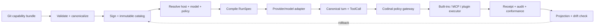

# Universal SSOT pipeline for skills, MCP, plugins, and models

วันที่ตรวจ: 2026-08-03

## Decision

เป้าหมายปลายทางคือ **one signed, versioned `codinal.capability` bundle** ให้ skills,
MCP servers/tools และ plugins อยู่ใต้ contract เดียวกัน แต่ยังไม่ควรเพิ่ม `v2` ตอนนี้

คำตัดสินจากการ scrutinize คือให้ใช้ **existing `codinal.integration.v1` เป็น authority เดียวก่อน** แล้วเพิ่ม
เพียง `RunSpec` และต่อเส้นทางให้ครบตั้งแต่ catalog → resolver → session → gateway จริง ค่อย migrate เป็น
`capability.v2` เมื่อ v1 มี production-path tests ผ่านแล้ว

Simpler alternative: reuse catalog/resolver เดิมและแก้ wiring/security gaps ก่อน แทนการสร้าง schema และ registry
ใหม่พร้อมกัน วิธีนี้ลด migration surface และทำให้พิสูจน์ได้ว่า SSOT มีผลต่อ execution จริง ไม่ใช่แค่ validate ได้

ไม่ควรใช้ MCP Registry หรือ runtime database เป็น SSOT ของ harness:

- MCP Registry เป็น centralized metadata/discovery สำหรับ public servers และชี้ไปยัง package/URL; มันไม่ได้เป็น policy หรือ trust decision ของเรา
  ([official registry](https://modelcontextprotocol.io/registry/about))
- Registry ยังอยู่ใน preview และ private servers ควรใช้ private registry/aggregator ของตนเอง
  ([registry guidance](https://modelcontextprotocol.io/registry/about#the-mcp-registry))
- Runtime DB ควรเก็บ state เช่น `enabled`, `connected`, approval และ receipt เท่านั้น ไม่ใช่ definitions

## SSOT hierarchy

ข้อกำหนดคือ fact แต่ละชนิดมี owner เดียว:

| Fact | Authority | Derived outputs |
|---|---|---|
| skill/plugin/MCP definition, policy, compatibility requirements | Git source bundle | immutable catalog artifact |
| package identity, digest, provenance, signature | immutable catalog | install/resolve index |
| model/host observed capability | conformance ledger | compatibility profile |
| connected/enabled/session/approval/receipt | runtime state DB | UI, recovery, audit |
| `~/.agents`, provider tool JSON, host config | generated projection | local discovery/execution |
| public server discovery metadata | MCP Registry/aggregator | candidate input only; never policy/trust |

This extends the current architecture instead of creating another spine: the repo already defines Git as policy/skill SSOT
(`MANIFEST.md:3-14`), separates source bundle/user overlay/live projection/host projection
(`CONTEXT.md:103-125`), and has an immutable filesystem catalog whose SQLite index is rebuilt from files
(`runtime/integrations/catalog.py:34-57`).

The current implementation still violates the single-owner rule: `IntegrationCatalog` and `ExtensionRegistry` are both
live registries, and the latter stores manifest definitions in SQLite (`runtime/control_plane/server.py:153-156,496-497`,
`runtime/extensions/registry.py:77-115`, `runtime/control_plane/app.py:773-857`). The migration must make
`IntegrationCatalog` the authority and demote/remove manifest writes from `ExtensionRegistry`; runtime DBs may retain
only pinned identity plus state, or an explicitly verified cache.

The same issue exists for session MCP state: `MCPStore` currently serializes and later reconstructs the complete server
definition (`runtime/mcp/store.py:81-113`). After migration it should retain only the catalog identity/digest, enabled
state and session metadata, then load the definition from the verified catalog.

## Canonical bundle (target, not current runtime input)

After the v1 path is wired and verified, evolve `codinal.integration.v1` into `codinal.capability.v2`; do not create
separate competing `skill.yaml`, `mcp.yaml`, and `plugin.json` authorities. The following is the target shape only:

```yaml
schema: codinal.capability.v2
id: publisher/name
version: 1.2.0
publisher: publisher
content_digest: sha256:...
provenance:
  source: git://...
  signature: sigstore-or-equivalent

assets:
  skills:
    - id: review
      path: skills/review/SKILL.md
      digest: sha256:...
  mcp:
    - id: github
      transport: http              # http or stdio
      endpoint: https://...
      auth_ref: secret://github
      include_tools: [search]
      tool_policy_ref: policy/github-tools
  plugins:
    - id: review-adapter
      executor: codinal.review.v1
      package_ref: oci://...

requirements:
  host_capabilities: [skill_discovery, tool_gateway]
  model_capabilities: [tools, structured_output]

permissions:
  requested: [workspace_read, external_read]
  default: ask

conformance:
  cases: conformance/review.json
```

Rules:

1. Skills contain portable instructions and references; they never grant authority. The current `SKILL.md` + `references/`
   format matches the portable Agent Skills model ([MCP Agent Skills guidance](https://modelcontextprotocol.io/docs/2026-07-28/develop/build-with-agent-skills)).
2. MCP metadata declares how to connect and which tools may be exposed; discovered tools must still pass schema, risk and
   policy checks. MCP itself separates prompts, resources and tools, with tools being model-controlled actions
   ([MCP server primitives](https://modelcontextprotocol.io/specification/2025-06-18/server/index)).
3. Plugins are declarative bindings to a trusted executor/package. No arbitrary `hooks`, `scripts`, or prompt-provided
   policy overlays. Existing translator behavior already rejects executable asset kinds and legacy instruction overlays
   (`runtime/plugins/translator.py:192-299`).
4. Secrets are references only. Never put tokens in Git, manifests, projections, prompts, or receipts.

## Scrutinize findings (must fix before v2)

1. **P0 — the resolver is not on the production path.** `compose_runtime` requires a resolver when integration grants
   are requested (`runtime/composition.py:167-191`), but the control-plane server passes only the catalog and never
   constructs/passes `IntegrationResolver` (`runtime/control_plane/server.py:463-498`). Fix this first and add a real
   session test that grants an integration, resolves it, and exposes its declared tools.
2. **P0 — even a wired resolver currently has no execution effect.** `EngineBuildContext` carries resolved integrations
   (`runtime/composition.py:41-53,196-209`), but the production `build_engine` creates the core registry and never reads
   `context.integrations` (`runtime/control_plane/server.py:229-395`). Session snapshots also persist only tool/command
   grants (`runtime/control_plane/server.py:448-451`), so integration identity would not survive restore. Add an explicit
   registration/dispatch step for resolved assets and persist a pinned `RunSpec` (or its inputs), then re-resolve on restore.
3. **P0 — there are multiple definition authorities.** `ExtensionRegistry.register()` persists/replaces manifests in
   SQLite, while `IntegrationCatalog` persists immutable filesystem artifacts; `MCPStore` also persists full server
   definitions. Choose the catalog as the only authority; turn extension/MCP tables into digest-pinned state projections
   or remove their definition APIs before adding a new bundle schema.
4. **P1 — “signed” is currently only metadata.** Catalog validation checks that `source`, `issuer`, and `signature` are
   non-empty and serializable, not cryptographically valid (`runtime/integrations/catalog.py:223-245`). On reload,
   `_read` also reconstructs `source_digest` from canonical bytes instead of preserving the original source digest
   (`runtime/integrations/catalog.py:153-175`). Add signature verification before activation and a restart/tamper test.
5. **P1 — MCP connection setup bypasses the proposed gateway.** The HTTP connect route calls the service with
   `approved=True` (`runtime/control_plane/app.py:2494-2530`), and enable follows the same path
   (`runtime/mcp/service.py:216-264`). Put connect/launch behind the same approval/policy command as tool calls and
   issue a receipt; arbitrary session definitions must not become executable merely because a route was called.
6. **P1 — a `RunSpec` can become stale after model switch/failover.** The current engine mutates `self.model` without
   re-resolving requirements, tool policy, or schemas (`runtime/turn_engine/engine.py:226-251`); the provider wrapper can
   silently try a configured fallback candidate (`runtime/providers/failover.py:101-155`). A switch/failover must either
   prove the replacement satisfies the same-or-stricter contract or create a new `RunSpec` and re-authorize tools; it
   must never silently widen authority.
7. **P1 — Python MCP and Rust ToolGateway are separate execution paths.** Python owns session lifecycle and long-lived
   connections (`runtime/mcp/client.py:37-155`), while Rust is experimental, defaults to an empty MCP program allowlist,
   and currently provides a bounded low-level executor (`crates/codinal-runtime/src/lib.rs:1263-1281`,
   `crates/codinal-tools/src/lib.rs:158-188,447-550`). Treat Python as the current policy owner and Rust as a delegated
   executor until both consume the same resolved object; do not claim one gateway before that contract is tested.
8. **P1 — MCP identity and isolation are underspecified.** Definitions have no `auth_ref` in the current config
   (`runtime/mcp/config.py:19-88`), connections are cached by `server.name` (`runtime/mcp/client.py:37-65`), and the
   durable store reloads the full definition (`runtime/mcp/store.py:81-113`). This cannot represent explicit credential
   subjects or safely pin a definition. Key connections by server digest plus auth subject/sandbox, resolve secrets only
   at the executor boundary, and store only the digest/state in the session DB.
9. **P2 — skill disablement is not universal yet.** The sync script links all source skills without applying disabled
   state (`harness/scripts/sync-skill-links.sh:200-229`), while the base adapter treats state application as unsupported
   (`harness/scripts/adapters/base.py:81-86`). Make unsupported projection explicit and test it; “disabled everywhere”
   cannot be a done criterion until each adapter has a deny/absence behavior.
10. **P2 — “resolves identically across models” is the wrong success test.** The resolver is intentionally model-aware,
    and current capability defaults differ by provider/model (`runtime/providers/capabilities.py:11-69`); failover also
    changes the candidate at request time (`runtime/providers/failover.py:101-155`). The invariant should be identical
    source/policy identity with explicit adapter-level `verified`/`degraded`/`incompatible` status, not byte-identical
    `RunSpec`s for every model.

## Universal execution pipeline (target invariant)



### 1. Validate and canonicalize

Validate the manifest and all asset digests using one schema implementation. Produce deterministic canonical bytes and a
content digest. Reject unknown fields, executable content, missing provenance, unsafe MCP endpoints, duplicate tool names,
and undeclared permissions.

### 2. Resolve

Resolve `(bundle_digest, host_id, model_id, policy_version)` into an immutable `RunSpec` containing:

- exact skill digests and loading order;
- exact MCP server/tool set and risk/approval policy;
- plugin executor IDs and package digests;
- model adapter and capability result;
- budget, timeout, sandbox and workspace roots.

Model names are not capabilities. Store capability states as `verified`, `declared`, or `unknown`; unknown must not silently
become true. The current provider capability code already fails closed for unknown models
(`runtime/providers/capabilities.py:62-69`), and the conformance runner is designed to assign tiers from harness-owned
cases (`harness/conformance/README.md:1-22`). Make that result part of `RunSpec`.

### 3. Compile for any model

Keep one canonical internal contract:

```text
CanonicalPrompt
CanonicalToolSpec (JSON-schema subset + risk metadata)
CanonicalToolCall
CanonicalToolResult
```

Provider adapters translate this contract into OpenAI-compatible, Anthropic, Gemini, Ollama, or other wire formats and
translate responses back. A model without native tool calling may use a strict structured-text adapter, but consequential
calls remain blocked unless parsing, schema validation, and approval all succeed. “All models” means the same contract and
explicit degradation, not pretending every model has identical capabilities.

### 4. Enforce once

Every consequential action goes through one Codinal policy chokepoint:

```text
skill text  -> informs the model only
model call  -> proposes canonical ToolCall
gateway     -> validates policy, scope, approval, schema, secrets, budget
executor    -> performs MCP/plugin/built-in action
receipt     -> records outcome, digest, and evidence
```

This is a target invariant, not a description of the current code: model-originated tool calls pass through
`TurnEngine`/`PermissionEngine`, but MCP connect/enable is a separate side effect and Rust is a separate executor path.
First make Python the explicit policy owner for both tool calls and connection setup. Then make Rust accept the same
resolved `RunSpec` as a delegated executor, with parity tests, before moving approval/receipt ownership there.

MCP is an execution boundary, not a trust boundary by itself. The official protocol requires lifecycle/capability
negotiation and JSON-RPC; its security guidance warns that local MCP servers can execute with client privileges and requires
explicit consent/sandboxing/least privilege for dangerous setup
([protocol](https://modelcontextprotocol.io/specification/2025-06-18/basic/index),
[security](https://modelcontextprotocol.io/docs/2026-07-28/tutorials/security/security_best_practices)).

## Recommended repository shape

```text
harness-flow/
  skills/                         # portable skill source
  MANIFEST.md                     # current source-bundle contract
  config/                         # host/model/policy schemas and defaults
  runtime/integrations/           # catalog/resolver implementation
  runtime/extensions/             # compatibility projection during migration only
  runtime/mcp/                    # session transport implementation
  harness/conformance/            # harness-owned capability cases/results
  crates/codinal-tools/            # execution/policy/receipt boundary
  state/                           # generated local state; never definition authority
```

`~/.agents`, provider tool schemas, MCP connection files, and host configs are projections. A projection may be user-owned
or managed, but it must carry source digest and ownership so drift is visible.

If a bundle-source directory is added later, it must be an explicit migration of the existing `skills/`/`MANIFEST.md`
source layout; the current repository has no working `integrations/` source path that the runtime consumes end to end.

## Rollout order

0. **Single owner:** freeze new writes to `ExtensionRegistry` manifests and full `MCPStore` definitions; make
   `IntegrationCatalog` the installed artifact authority and retain only digest-pinned compatibility/state data elsewhere.
1. **Wire v1:** construct and pass `IntegrationResolver` in the production server, register its resolved assets in
   `build_engine`, and prove integration grants/tool exposure through a session-level test.
2. **Secure setup:** route MCP connect/enable through policy + approval, record setup receipts, and reject definitions not
   resolved from the catalog.
3. **RunSpec:** compile one resolved artifact for `(bundle, host, model, policy)`, persist its pinned inputs, and
   re-resolve on restore/model switch/failover; allow only the same or stricter tool/permission contract.
4. **Gateway convergence:** route Python MCPService and Rust ToolGateway through that resolved policy; add parity tests
   before changing ownership of approval/receipt execution.
5. **Projection:** make skill enabled/disabled behavior explicit per adapter, verify digest/ownership on every host, and
   report unsupported projection instead of silently linking an enabled-looking skill.
6. **Only then:** add `codinal.capability.v2` fields for stdio/auth/plugin/conformance and migrate with a versioned,
   signed compatibility test.

## Definition of done

- The same bundle digest preserves identical asset/policy identity across at least four model/provider adapters; each
  `RunSpec` records explicit adapter and `verified`/`degraded`/`incompatible` status.
- Every exposed tool has one canonical name, schema digest, risk class and approval rule.
- A disabled or incompatible asset is absent or explicitly blocked in every projection; no silent fallback.
- No plugin or skill can grant permissions that are not present in the resolved policy.
- Every MCP/plugin/external call has a bounded receipt and audit record.
- Registry/network failure cannot change the currently locked artifact.
- Drift reports identify source, projection, runtime-state and user-overlay changes separately.
- A restart preserves the original source digest and tampering/signature failure prevents activation.
- Model switch/failover cannot widen the resolved tool or permission set.
- MCP connection setup is approved and audited just like a consequential tool call.
- No second registry can mutate the definition selected by the catalog.

## Bottom line

The best target remains **Git-authored, signed capability bundles + an immutable local catalog + one resolved RunSpec + one
policy/execution gateway**. The immediate best move is smaller: make the existing v1 catalog/resolver the only authority,
wire it into production, close MCP setup and provenance gaps, then introduce v2. Keep the official MCP Registry for
discovery, Agent Skills as the portable instruction format, and plugins as declarative references to trusted executors.
